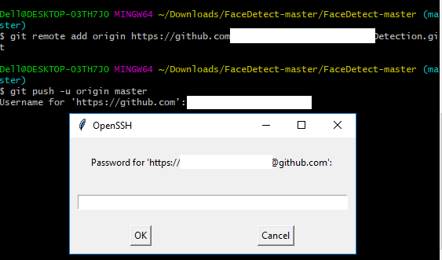
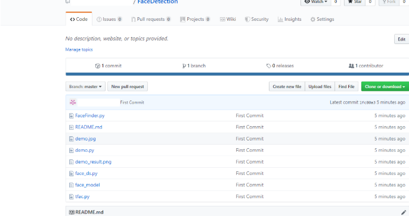

# Git的使用

## 实验目的

1. 学习 Git 软件的安装
2. 学习 Git 的简单使用，增加文件，提交，创建分支，增加远程，下拉、上推，合并
3. 学习 Git 的冲突处理 

## 实验平台

1.  Windows 10

## 实验前准备

1.  下载安装Git
2.  查阅Git相关基础知识和命令
3.  掌握Markdown语言的知识

## 目录

1、Git的安装

​	1.1 下载

​	1.2 安装

2、Git的使用

​	2.1 打开git gui

​	2.2 配置个人信息

​	2.3 增加文件

​	2.4 提交

​	2.5 创建分支

​	2.6 增加远程

​	2.7 下拉

​	2.8 上推

​	2.9 合并

​	2.10 冲突处理

3、实验总结

## 实验内容

### 1. Git的安装

#### 1.1下载

下载地址：下载地址：https://www.git-scm.com/download/

#### 1.2安装

1.2.1 点开exe文件

1.2.2 点击下一步，安装相应的组件

1.2.3 选择默认编辑器

1.2.4 配置路径

1.2.5 选择后台传输方式

1.2.6 Git处理文本方式，默认

1.2.7 选择终端，默认

1.2.8 额外选项

1.2.9 安装中

1.2.10 完成安装

### 2. Git的简单使用

#### 2.1打开Git GUI

2.1.1 在数据目录下，右键点击Git GUI here，这样一个仓库就创建完成了

2.1.2 图形界面如下

#### 2.2 配置个人信息

2.2.1 点击导航栏，Edit--options，可以看到配置信息

2.2.2 填写以下信息，用户名、邮箱地址、以及字符编码选择UTF-8

#### 2.3 增加文件

2.3.1 在数据目录下新增了文件后，需要把文件移入暂存区

使用命令git add ，注意，可反复多次使用，添加多个文件；

或者在Git GUI界面按ctrl+i

使得Unstaged Changes的文件移动到Stages Changes

#### 2.4 提交

2.4.1 当文件添加后

此时文件处于暂存区，如果需要移入本地仓库，需要用到git命令git commit

或者在git gui点击commit或者ctrl+enter

注意：commit文件必须在Commit Message写备注文字

#### 2.5 创建分支

2.5.1 在目录下右键Git Gui，点击菜单栏上的 Brand，选择 Create 

2.5.1 新增分支名，如git

2.5.2 新增分支后打开Branch-Checkout，可以看到分支情况并切换分支

2.5.3 切换分支后可以在分支添加功能， 当我们在新的分支完成工作有，需要把新的任务合并到主分支。

\1. 切换回主分支
       \2. 选择菜单 Merge 。LocalMerge 可以看到分支和主分支合并了

#### 2.6 增加远程

2.6.1 打开Git GUI - Remote - Add

2.6.2 填上备份仓库名和备份地址，Further Action选择第二个：初始化远程仓库并PUSH

2.6.3 在上一步提交后，push不成功

2.6.4 尝试自己在备份仓库新建git仓库

2.6.5 在备份目录下使用git bash命令行

> $git init

2.6.6 再回到Git GUI打开 Remote - Add，Further Action选择第一个：不初始化仓库，又弹出以下报错

> mote: error: By default, updating the current branch in a non-bare repository
>
> remote: error: is denied, because it will make the index and work tree inconsistent
>
> [remote rejected] master -> master (branch is currently checked out)

2.6.7问题分析

​	如果使用了git init初始化，则远程仓库的目录下，也包含work tree，当本地仓库向远程仓库push时, 如果远程仓库正在push的分支上（如果当时不在push的分支，就没有问题）, 那么push后的结果不会反应在work tree上,  也即在远程仓库的目录下对应的文件还是之前的内容。

2.6.8 解决办法

2.6.9 这是由于git默认拒绝了push操作，需要进行设置，修改.git/config文件后面添加如下代码：

> [receive]
> denyCurrentBranch = ignore

2.6.10 无法查看push后的git中文件的原因与解决方法

在初始化远程仓库时最好使用如下命令

> git --bare init

2.6.10 重新操作新增远程步骤，打开Git GUI后commit和push，结果截图如下

#### 2.7 下拉

如果你在存储库中进行更改, 则GIT PULL可以允许其他人查看更改。它用于确认你对正在使用的存储库所做的更改。或也称为目标存储库。

从分支拉出的简单命令是：

git pull’remote_name”branch_name’。

git pull命令是git fetch和git merge的组合, git fetch提取本地存储库中的最新提交, 而git merge会将分支从远程合并到本地分支, ‘remote_name’是存储库名称, ‘branch_name’是名称特定分支的。

#### 2.8 上推

7.从GitHub复制远程存储库的URL。

- HTTPS或URL是从给定的GitHub帐户复制的, 该帐户是远程存储库的位置。

8.将复制的URL(即你的远程存储库)添加到将存储库中的本地内容推送到的URL。

- git remote add origin’你的网址名称’
- 在上面的代码中, “源”是远程名称, 远程URL是” https://github.com/000xx/FaceDetection.git”。在这种情况下, 你可以将远程站点视为GitHub, 并且GitHub提供了用于添加到远程存储库的URL。

9.将本地存储库中的代码推送到GitHub

- git push -u origin master用于将本地内容推送到GitHub。
- 在代码中, 源是默认的远程存储库名称, ‘-u’标志位于上游, 等效于’-set-upstream’。主节点是分支, name.upstream是我们已克隆项目的存储库。
- 填写你的GitHub用户名和密码。

10.查看托管在GitHub上的存储库中的文件。

- 你最终可以看到托管在GitHub上的文件。

#### 2.9 合并

2.9.1 打开Git GUI，Branch -- Create，新建分支branch1

2.9.2 新建分支branch2 

2.9.3 Merge -- Localmerge，先选择master分支和branch1分支合并，合并成功

2.9.4 再选择master分支和branch2分支合并，合并也成功

2.9.5 此时看到当前的分支历史如下图

2.9.6切换分支branch1，新建txt文件branch，内容为“第一个分支的新文件”，branch1文件再增加一行

2.9.7同理切换分支branch2，新建新建txt文件branch，内容为“第二个分支的新文件”，branch2文件再增加一行

2.9.8 选择master分支和branch1分支合并，合并成功

#### 2.10 冲突处理

2.10.1 但master分支和branch2分支合并，合并失败，错误提示branch.txt合并冲突

2.10.2 再找原因，原来是branch1中的branch.txt内容和branch2的内容不一致，系统不知道如何合并，要我们自行取舍

2.10.3 将文件内容的其他提示删去，留下“第一个分支的新文件”“新增分支2文件”即可解决冲突

## 3. 实验总结

git的特点大致总结起来的话，有以下几点：

- 记录快照，而不是存储差异数据
- 操作本地化，没有网络延时困扰
- 检验文件的完整性，杜绝文件内容或目录内容被篡改
- 一般只添加数据，数据丢失可能性小